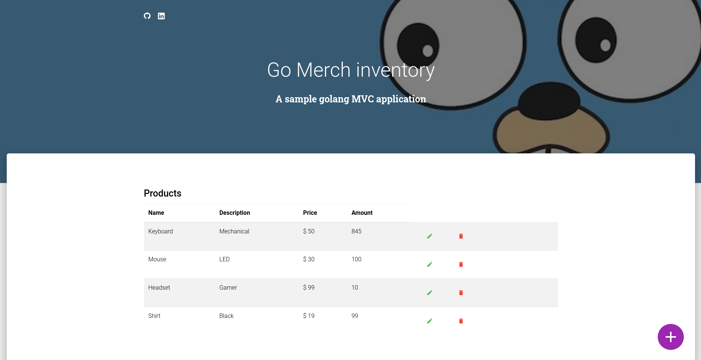

# Go Merch inventory - A sample golang MVC application

[](https://fargate.chat)

A simple MVC webapp built with golang standart library(mostly) and some vanilla javascript, running on docker container locally.

Stack:
- **Postgres** persistency
- **Golang** routing, serve-side rendering and business layer
- **JavaScript** rich content on the frontend
- **Docker** easy build a deploy of the apllication and database


## Run it locally

To run the application on your local machine you need:

- `docker`
- `docker-compose`
- `make`

Execute the following command:

```
make run
```

The application will be available at `http://localhost:8000`

If you make changes to the code, you can run:

```
make build
```

This updates the application.
